|Serial No.  |Name                    |GitHub UserName      |Photo                                                                       |Your Inspirational Quote                                           |Institution                                          |Email Id                               |
|:----------:|:----------------------:|:-------------------:|:--------------------------------------------------------------------------:|:-----------------------------------------------------------------:|:---------------------------------------------------:|:-------------------------------------:|
|1           |Aritra Roy              |aritraroy24          |                          |“Knowledge is power.”                                              |Pondicherry University                               |aritraroy24@gmail.com                  |
|2           |Andrea Ortiz            |aortiz24             |                             |“Simplicity is the soul of efficiency.”                            |University of Texas at Tyler                         |aortiz1865@gmail.com                   |
|3           |Paulo Amaral            |phfa26               |                               |“Make it work, make it right, make it fast.”                       |AIT Academy of IT - Sydney, AU                       |paulo@amaral.com.au                    |
|4           |Priyansh Tripathi       |PriyanshTri          |                          |“First, solve the problem. Then, write the code.”                  |GLA university                                       |priyanshtripathi007@gmail.com          |
|5           |Sayok Dey Majumder      |NeilSayok            |                            |“Fix the cause, not the symptom.”                                  |University Of Engineering and Management, Kolkata    |sayokdeymajumder1998@gmail.com         |
|6           |Erikh Domingues      |erikhlp           |                            |“No rain, no rainbow”                                  |University Of Computer Science, UniRitter    |domingueserikh@gmail.com      |
|7           |Rahul Soni      |RahulSoni0          |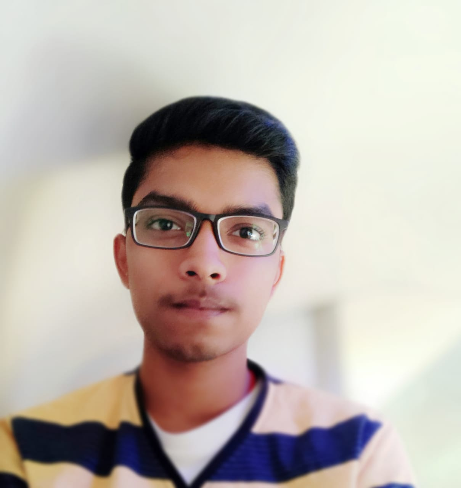                            |“everything happens for a cause or good reason”                                  |National institute Of Technology , Jamshedpur    |rahul.kumar.soni2511@gmail.com      |
|8           |Aritra Roy      |AriCompChem          |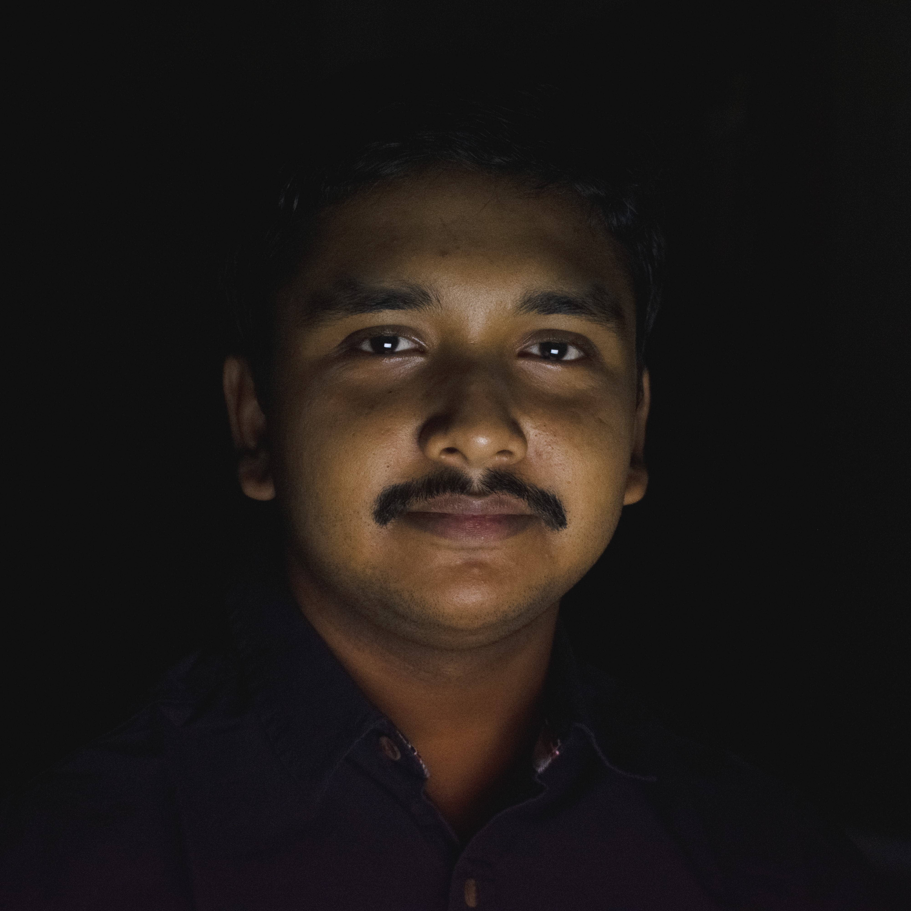                            |“Anyone who is not shocked by the quantum theory has not understood it.”                                  |CIS Laboratory, Pondicherry University    |aritraroy24@gmail.com      |
|9	     |Tanmay SHarma	      |Tanmay-s55	    |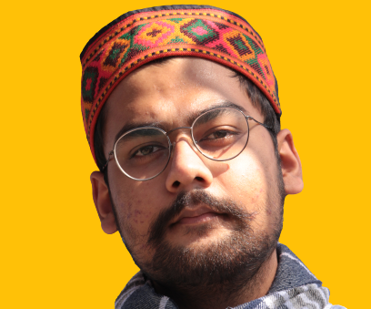                |“Set thy heart upon thy work, but never on its reward.”			     |Graphic Era University,Dehradun			   |tanmayin55@gmail.com                   |
|10           |Kartikeya Rawat      |kartikeya47          |                            |“Once a new technology rolls over you, if you're not part of the steamroller, you're part of the road.”                                  |VIT University    |kartikeya.rawat2020@vitstudent.ac.in      |
|11            |Saiyam Verma    |Saiyam7404            | |“You do not find the happy life. You make it.” |Thapar University,Patiala  |saiyamverma722@gmail.com   |
|12            |Raj Kumawat    |rajkumawat01           |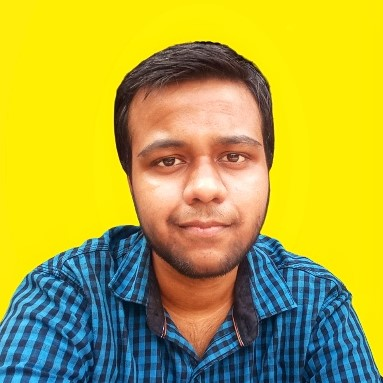 |“Do good and good will come to you.” |Pimpri Chinchwad college of Engineering  |raj.s.kumawat37@gmail.com   |
|13            |Kirti Singla    |codesanat142            |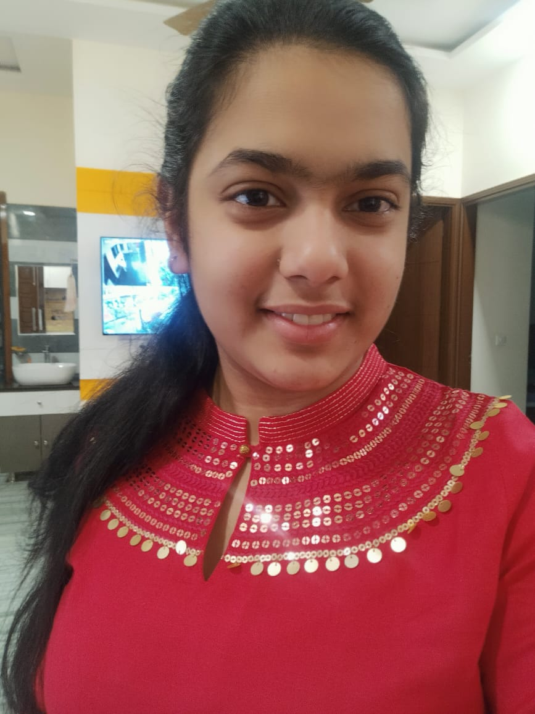 |“Keep smiling always” |Indian Institute of Information Technology Allahabad  |singla.kirti2002@gmail.com   |
|14            |Saiyam Verma    |Saiyam7404            | |“You do not find the happy life. You make it.” |Thapar University,Patiala  |saiyamverma722@gmail.com   |
|15           |Hector Quemada      |hdquemada            |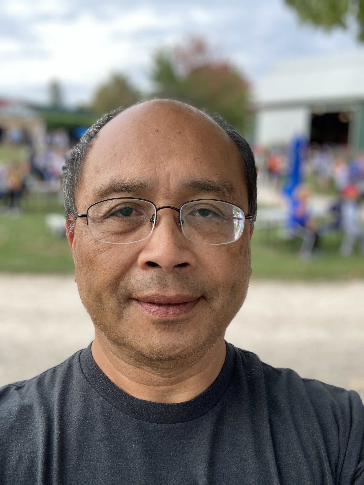                            |“It is better to light one small candle than curse the darkness.”                                  |Western Michigan University    |hdquemada@gmail.com         |
|16          |Aditi Yadav             |adtoria              |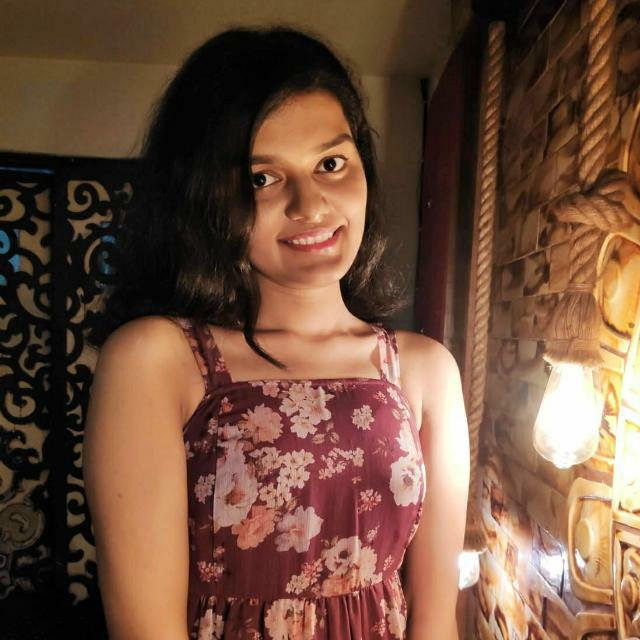                              |“A man is his greatest enemy.”                                     |IIIT Allahabad                                       |adityyyyadav@gmail.com                 |
|17             |Tamanna Sharma         |Tamanna-S          |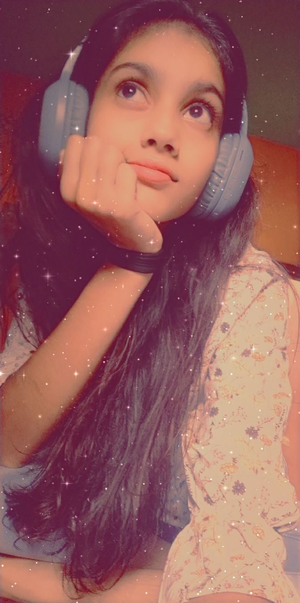           |"Everyday chellenge yourself."         |NA         |ts.harma2882006@gmail.com|
|18          |Anjali Sahu             |99anjali             |                              |“Shoot for the moon even if you miss u will land among stars.”                              |IIIT Allahabad                                       |sahuanjali7208@gmail.com
|19 |Julie Cestaro  |julieces | |"Any sufficiently advanced technology is indistinguishable from magic" | New York University |keepingmyemailprivate@gmail.com  |
|20         |Coding-Boon        |Coding-Boon            |                            |Write it. Shoot it. Publish it. Crochet it, sauté it, whatever. MAKE.   |freelancer |coding-boon@kaengu.ru  |
|21 |Jared Clayborn | JaredsCode | | "Form follows function. Don't force it" | N/A | jared.clayborn@gmail.com |
|22         |Raja Sethi         |RAJASETHI            |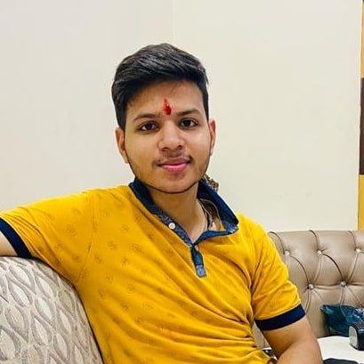                            |"Live your life to the fullest"   |LNMIIT |rajasethi056@gmail.com  |
|23 |Aman Upadhyay | AmanxUpadhyay | | "Don't Dream about getting Super cars when you start. Try to sustain the living standards you parents provided you" | Amity University | amanupadhyay0208@gmail.com |
|24          |Arnab Shrivastav             |arnabshrivastav             |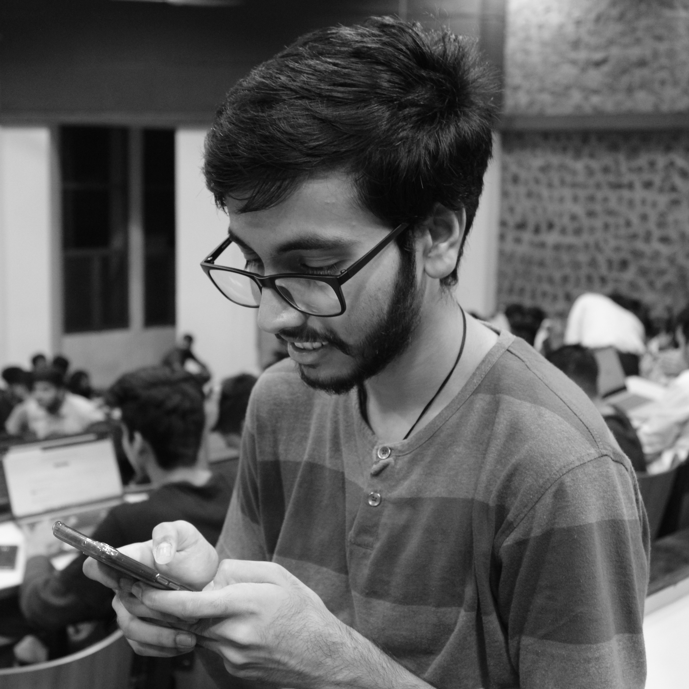                              |"More is lost by indecision than wrong decision.”                              |JUET, Guna                                       |arnab.s.shrivastav@gmail.com  
|25             |Vanshika Sharma            |viroopaksh-utrayak             | 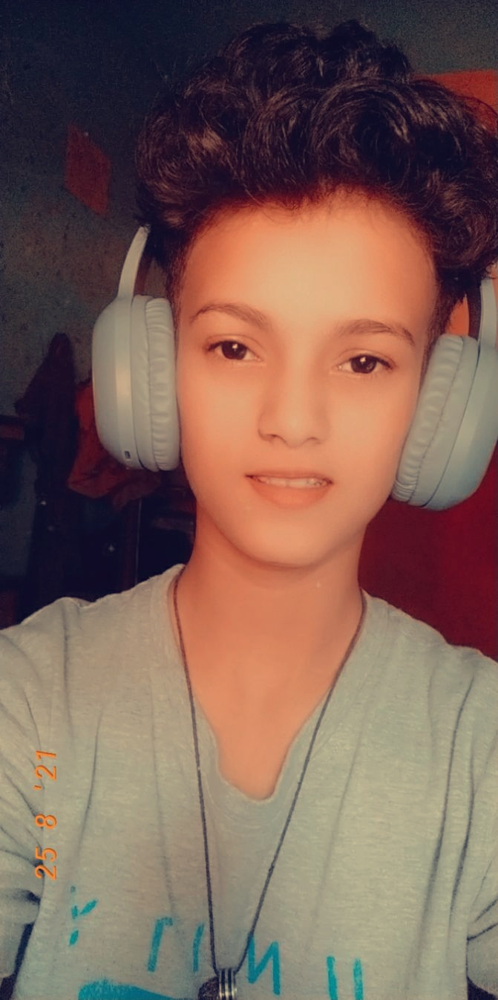           |"Smile no one cares how you feel"     |NA         |sharmavanshika468@gmail.com        |     
|26          |Sumit Singh Rawat             |Sumit24-prog         |                                                                 |“Keep Going Everything you nedd will come to you at perfect time” |NA         |rawatsingh2112singh@gmail.com
|27          |Sarthak Roy             |sarthakroy2002    |                          |“Life gives one last chance to everyone, just need to see which is the last one that can change our life”                                          |Amity University Kolkata                               |sarthakroy2002@gmail.com                  |
|28 |Anubhav Singh |singhanubhavme |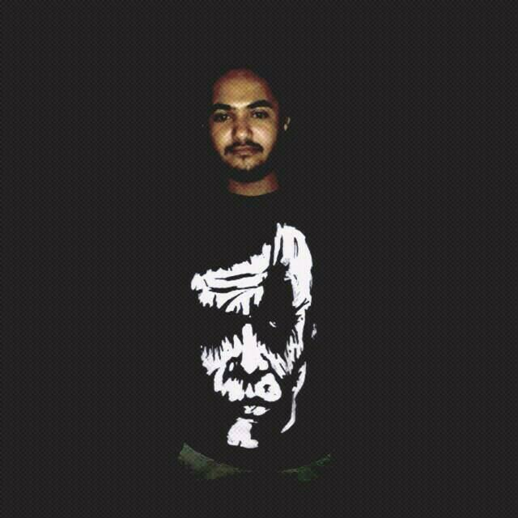 |"No Pain No Gain" |Graphic Era |singhanubhav58@gmail.com
|29 | Ganesh Duvva | ganaaduvva | 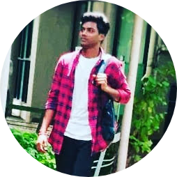 | "Education is a Powerful Weapon" | SVS Group of Institution | ganaduvva.786@gmail.com |
|30 |Ashan Tharaka |ashan-tharaka||"Work hard in silence, let your success be the noise."|University Of Moratuwa,Sri Lanka|ashantharaka715@gmail.com   |
|31          |Akash Roy                   |IMF-missionimpossible                   |                                                                |“If you can dream it you can do it”        |KIIT       |007.lisencetokill@gmail.com |
|32          |Garvit Verma                |GarvitV957            |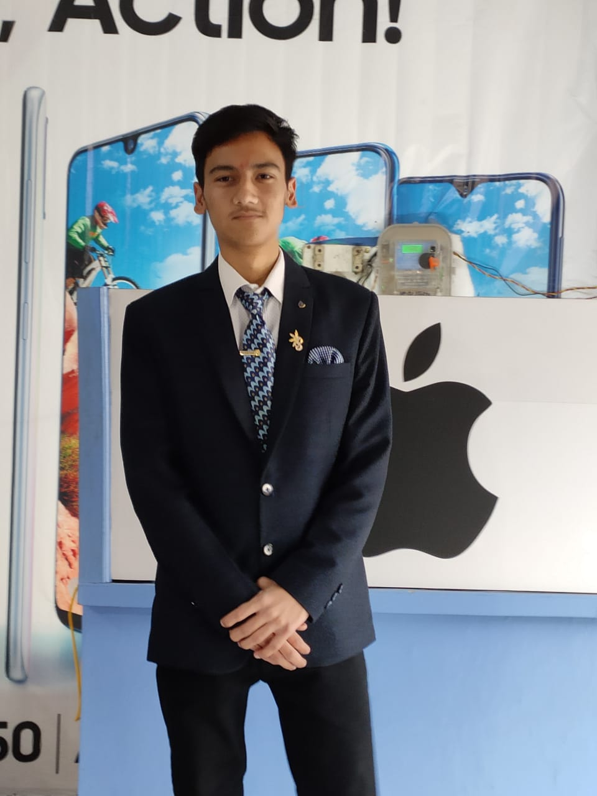                      |"Kill them with your smile, burry them with your success"              |IIT Mandi                     |garvitverma89@gmail.com
|33       |SWAYAM JILLA           | SwayamJilla      |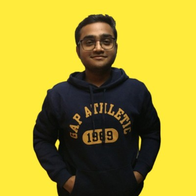   |No luxurious life is greater than moms happiness    |Padmabhushan vasantdada patil college of engineering       |swayamjilla@gmail.com    |
|34          |Kajal Kaushal   |Kajal-7           |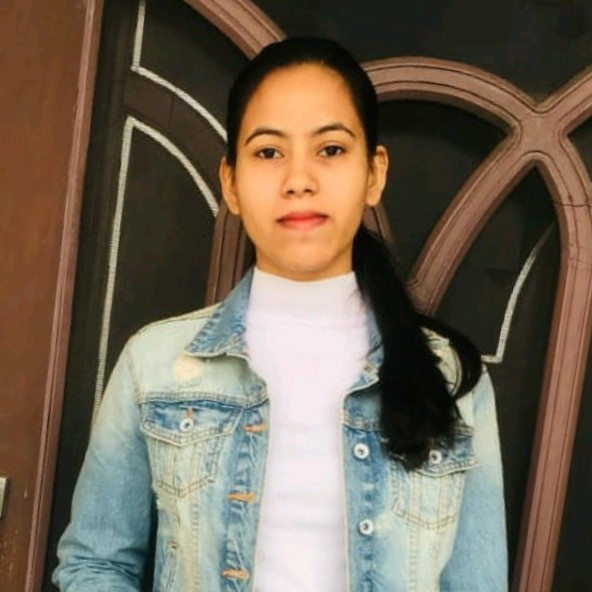 |“Believe in yourself.” |Indian Institute of Information Technology Allahabad  |kajalkaushal700@gmail.com   |
|35          |Fahad Umar                |fahadmaheri           |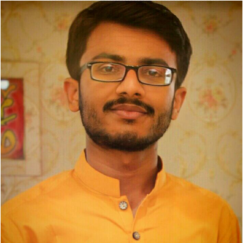             |"Believe you can and you're halfway there"              |Shaheed Zulfiqar Ali Bhutto Campus Khairpur Mir's                    |fahadumarmaheri@gmail.com |
|36          |Anees Abbasi  |AneesAbbasi          |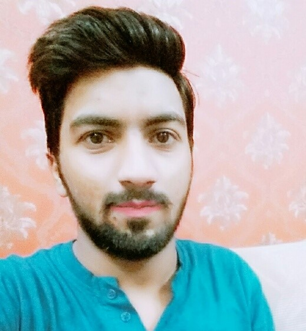 |“If opportunity doesn't knock, build a door.” |MUET SZAB |aneesabbasi574@gmail.com   |
|37          |Aashita Chouhan  |aashitachouhan          |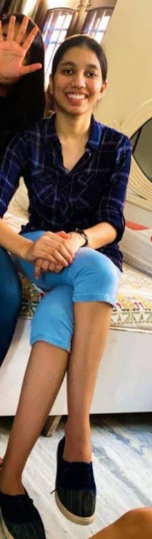 |“Win from within” |IIIT Allahabad |aashita1505chouhan@gmail.com   |